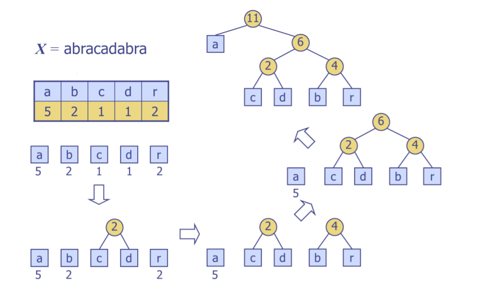

# HUFFMAN CODING ALGHORITAM

Problem koji resava Huffmanov algoritam je kompresija teksta (slike) bez gubljenja informacija. Svaki karakter se kodira kodom (npr. 00, 01, 110...) cija duzina je **obrnuto srazmerna frekvenciji karaktera**. Odnosno, karakteri koji se pojavljuju vise puta u tekstu ce imati kraci kod. 

Problem: **Pronaci optimalne kodove za svaki karakter tako da nijedan kod ne bude prefiks drugog koda**

Resenje: Kreiranje Huffmanovog stabla kodiranja

Primer : 
```python
s = "ABACA"
frequency = {
      "A" : 3,
      "B" : 1,
      "C" : 1
}

```


```python
encoded_s = 1001011

```
Listovi predstavljaju karaktere u ulaznom stringu, a kod svakog karaktera se odredjuje putanjom od korena do lista gde svako skretanje u levo predstavlja 0, a skretanje u desno 1.

Inicijalno string zauzima : broj karaktera * 8 bits =**48 bita**

Kodirani string zauzima : **7 bita**

Kreiranje Huffmanovog stabla vrsi se na sledeci nacin:
1. Za svaki karakter se racuna frekvencija
2. Za svaki karakter se kreira korenski cvor u stablu koji cuva karakter i njegovu frekvenciju
3. Biraju se cvorovi sa najmanjom frekvencijom i spajaju u novi cvor cija frekvencija je zbir frekvencija levog i desnog cvora
4. Ponavlja se postupak 3 dok ne ostane jedan korenski cvor




### Sekvencijalno resenje
Problem bi bio resen sekvencijalno u programskom jeziku Python. Rezultat kodiranja bi bio kodiran ulazni tekst i datoteka koja reprezentuje huffmanovo stablo u svakoj iteraciji (stablo bi bilo predstavljeno kao niz [cvor, levo podstablo, desno podstablo]


### Paralelno resenje
Paralelizacija bi se ukljucila u 
1. pronalazenje frekvencija svakog karaktera (ulazni tekst bi se podelio u delove i na kraju bi se sabirale frekvencije)
2. Paralelno kreiranje Huffmanovog stabla


Koristila bi se *multiprocessing* biblioteka u Pythonu.


